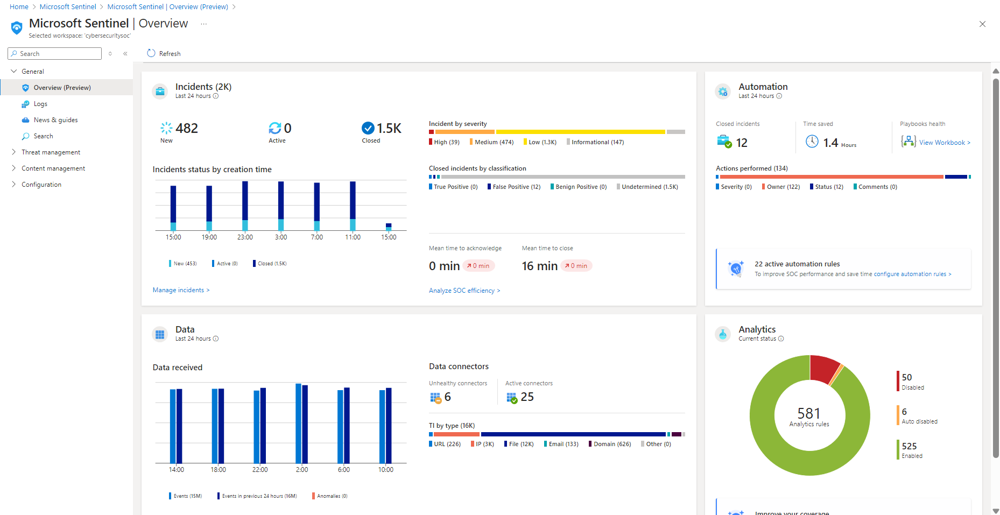
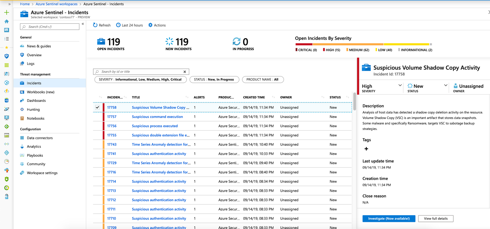

# Azure SOC Lab: Microsoft Sentinel Threat Detection

## Project Description
A hands-on lab to simulate Security Operations Center (SOC) tasks using Microsoft Sentinel.

## Features
- Log ingestion from Azure Active Directory.
- Custom KQL queries for threat detection.
- Incident simulation and investigation.

## Tools Used
- Microsoft Sentinel
- KQL (Kusto Query Language)

## Screenshots

### Microsoft Sentinel Dashboard

### Sample Incident Alert
