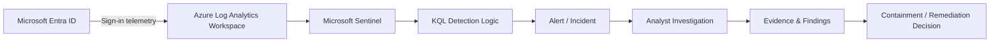
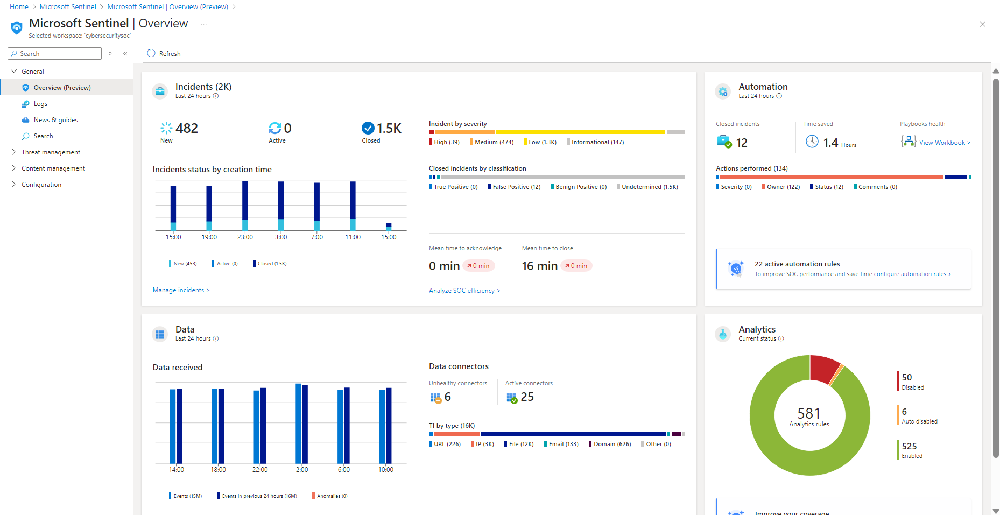
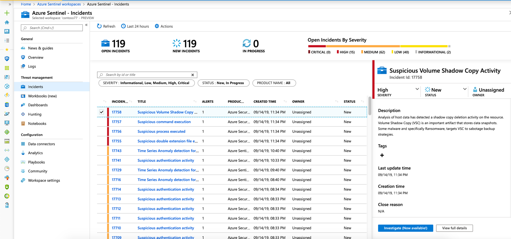

# Microsoft Sentinel SOC & Threat Detection Lab

[](https://github.com/KaffyDevelops/azure-soc-lab/actions/workflows/repository-quality.yml)

> **Project type:** Independent hands-on cloud security lab  
> **Focus:** SIEM, KQL detection engineering, identity telemetry, incident investigation and evidence-led response  
> **Platform:** Microsoft Azure  
> **Status:** Active and being expanded

## Executive Summary

This project documents a hands-on Security Operations Centre workflow using **Microsoft Sentinel** and Microsoft Entra ID sign-in telemetry.

The aim is not simply to demonstrate access to a SIEM. The repository is being structured to show how a cloud security analyst or engineer moves from **telemetry → detection logic → alert → investigation → evidence → response decision**.

The current implemented detection identifies repeated failed Microsoft Entra ID sign-in attempts using Kusto Query Language (KQL). The repository will expand into a broader catalogue of documented cloud identity and security detections as each scenario is implemented and validated.

## Security Problem

Cloud identities are a major attack surface. Repeated authentication failures can indicate password guessing, brute-force activity, credential abuse or poorly configured automated access.

A useful SOC workflow therefore needs to answer:

- What telemetry is available?
- What behaviour should generate a detection?
- How should the detection be tuned?
- What evidence should an analyst collect?
- What false positives are possible?
- What response actions are appropriate?

This lab is designed around those questions.

## Current Architecture


```mermaid
flowchart LR
    A[Microsoft Entra ID] -->|Sign-in telemetry| B[Azure Log Analytics Workspace]
    B --> C[Microsoft Sentinel]
    C --> D[KQL Detection Logic]
    D --> E[Alert / Incident]
    E --> F[Analyst Investigation]
    F --> G[Evidence & Findings]
    G --> H[Containment / Remediation Decision]
```

See [`docs/lab-architecture.md`](docs/lab-architecture.md) for the architecture and trust-boundary notes.

## Implemented Detection Catalogue

| ID | Detection | Data Source | Status | MITRE ATT&CK |
|---|---|---|---|---|
| DET-001 | Repeated failed sign-in attempts | `SigninLogs` | ✅ Implemented | T1110 Brute Force |

### DET-001: Repeated Failed Sign-ins

The current KQL query groups failed Microsoft Entra ID sign-ins by IP address and user principal name, then flags combinations that exceed the configured threshold.

```kusto
SigninLogs
| where ResultType == "50126"
| summarize FailedAttempts = count() by IPAddress, UserPrincipalName
| where FailedAttempts > 5
| project IPAddress, UserPrincipalName, FailedAttempts
```

Full documentation: [`detections/DET-001-brute-force.md`](detections/DET-001-brute-force.md)

Query file: [`kql-queries/brute-force.kql`](kql-queries/brute-force.kql)

## Detection Roadmap

These are **planned scenarios**, not yet claimed as implemented:

- [ ] DET-002 Password spraying across multiple accounts
- [ ] DET-003 Suspicious privileged-role activity
- [ ] DET-004 Repeated MFA failures
- [ ] DET-005 Dormant-account sign-in activity
- [ ] DET-006 Suspicious geographic sign-in patterns
- [ ] DET-007 High-volume authentication failures from a single source
- [ ] DET-008 Unusual administrative activity

Each detection will only move into the implemented catalogue after the query, test scenario, evidence and analyst notes are added to this repository.

## Investigation Workflow

For each alert or detection, the intended analyst workflow is:

1. **Confirm the signal** and identify the triggering event.
2. **Identify the affected identity**, source IP and relevant time window.
3. **Review surrounding authentication activity** for patterns or related events.
4. **Determine whether the behaviour is expected, suspicious or malicious.**
5. **Document evidence**, including queries, screenshots and observations.
6. **Assess severity and scope.**
7. **Recommend containment or remediation**, such as credential reset, access review, MFA enforcement, blocking or additional monitoring.
8. **Record lessons learned** and tune the detection where necessary.

## Evidence

### Microsoft Sentinel Dashboard



### Sample Incident Alert



The screenshots are retained as supporting evidence, but the long-term standard for this repository is to connect every screenshot to a documented detection, investigation step or validation result.

## Repository Structure

```text
azure-soc-lab/
├── .github/
│   └── workflows/
│       └── repository-quality.yml
├── README.md
├── images/
│   ├── incident-alert.png
│   └── sentinel-dashboard.png
├── kql-queries/
│   └── brute-force.kql
├── detections/
│   └── DET-001-brute-force.md
├── docs/
│   ├── lab-architecture.md
│   ├── evidence-standard.md
│   └── validation-plan.md
├── incidents/
│   └── README.md
├── CONTRIBUTING.md
└── SECURITY.md
```

## Tools & Technologies

- Microsoft Sentinel
- Microsoft Entra ID
- Azure Log Analytics
- Kusto Query Language (KQL)
- Cloud identity telemetry
- MITRE ATT&CK mapping
- GitHub Actions

## What This Project Demonstrates

This repository is intended to demonstrate practical capability in:

- SIEM operations
- cloud identity monitoring
- KQL query development
- detection engineering
- alert triage
- incident investigation
- evidence collection
- threat mapping
- false-positive analysis
- remediation thinking
- repository quality automation

## Validation Standard

A detection is not considered complete merely because the query executes successfully.

For this project, a completed detection should include:

- a defined security objective
- documented data source
- KQL query
- test or simulation scenario
- expected result
- captured evidence
- false-positive considerations
- MITRE ATT&CK mapping where appropriate
- analyst triage guidance
- recommended response actions
- limitations and tuning notes

See [`docs/validation-plan.md`](docs/validation-plan.md).

## Limitations

This is a controlled portfolio lab and should not be interpreted as production SOC employment experience.

Current limitations include:

- limited data volume compared with an enterprise tenant
- one implemented detection at the current stage
- simulated rather than production incidents
- no claim that the current threshold is universally suitable for production environments

Those limitations are documented deliberately so the project shows both technical capability and engineering judgement.

## Next Steps

- Expand the detection catalogue one tested scenario at a time
- Add incident timelines and analyst findings
- Add query tuning and false-positive notes
- Map detections to MITRE ATT&CK techniques
- Add reusable investigation queries
- Expand automated repository quality and detection validation checks
- Link each implemented detection to the corresponding portfolio case study

## Portfolio

For the recruiter-facing case study and wider cloud security work, visit:

**https://kaffy.thecloudforge.app**

---

**Author:** Kafayat “Kaffy” Faniran  
**GitHub:** [@KaffyDevelops](https://github.com/KaffyDevelops)
