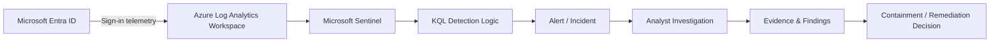

# Lab Architecture

## Purpose

This document describes the logical flow of the Azure SOC lab and the main trust boundaries relevant to detection and investigation.

## Logical Flow

## Components

### Microsoft Entra ID

Source of identity authentication telemetry used by the lab.

### Azure Log Analytics Workspace

Stores searchable log data used by Microsoft Sentinel and KQL queries.

### Microsoft Sentinel

Provides the SIEM layer for detection, alerting and investigation workflows.

### KQL Detection Logic

Transforms raw telemetry into security signals based on defined conditions.

### Analyst Investigation

Adds human context, validates the signal, identifies scope and distinguishes suspicious activity from expected behaviour.

### Evidence & Findings

Captures screenshots, queries, timelines, observations and conclusions so that decisions are traceable.

## Trust Boundaries & Security Considerations

- **Identity telemetry boundary:** Log quality determines detection quality. Missing or incomplete sign-in data reduces visibility.
- **Query logic boundary:** Detection thresholds and grouping logic can create false positives or false negatives.
- **Analyst decision boundary:** A detection is not automatically an incident. Human review is required before strong conclusions are drawn.
- **Evidence boundary:** Screenshots and exported logs should be sanitised before public publication if they contain sensitive identities, IP addresses or tenant information.

## Production Considerations Not Fully Represented in This Lab

A production implementation could additionally include:

- data retention requirements
- RBAC for Sentinel and Log Analytics
- privileged access management
- ingestion cost controls
- automation rules and playbooks
- threat-intelligence enrichment
- alert suppression and tuning
- case management integration
- regulatory retention requirements
- separation of analyst and administrative duties

This repository intentionally documents those gaps rather than presenting the lab as production-equivalent.
